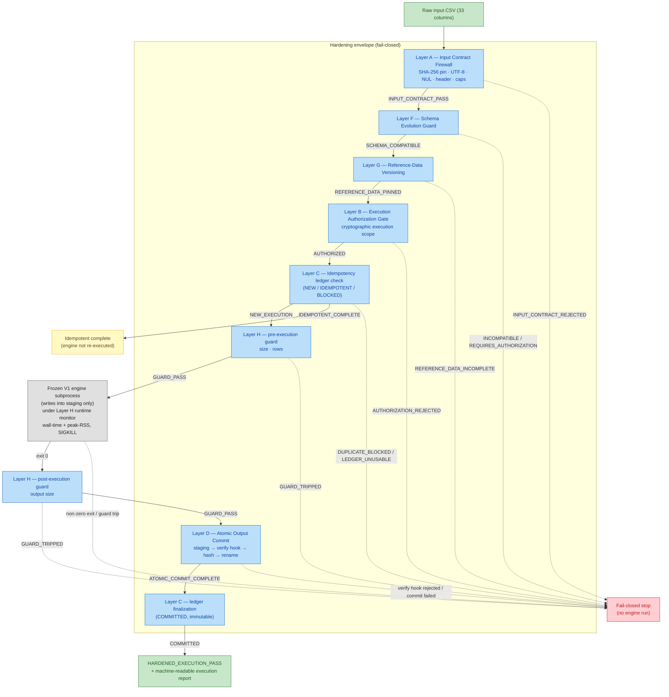
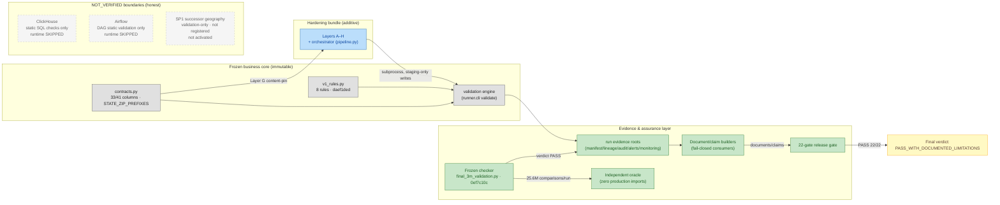

# Data Quality Assurance & Evidence Integrity Platform

**DQAEIP** — deterministic 33→41-column consumer data-quality validation with a **frozen 8-rule V1 business core**, an **additive 8-layer operational-hardening envelope (A–H)**, and a **fail-closed, clean-room evidence chain** in which every release claim is machine-derived from hashed source artifacts and re-derivable on demand.

[](#final-verdict)
[](#release-identity)
[](#release-identity)
[](#verification-results)
[](#verification-results)
[](#verification-results)
[](#v1-business-semantics)
[](#negative--fail-closed-testing)
[](#verification-results)
[](#verification-results)

> **How this document was produced.** This README was generated by a
> read-only forensic audit of the actual repository state (filesystem,
> Git history, source code, and evidence artifacts). Every hash below
> was recomputed from actual file bytes; every count and verdict was
> read from the current machine-readable evidence, never from prior
> reports or remembered values. Documentation is **not** a source of
> truth for its own claims — the evidence tree is.

---

## Executive Status

| Property | Value |
|---|---|
| Final release | `DQAEIP-FINAL-HARDENED-RELEASE-2026-09-19` (kind: `OPERATIONAL_HARDENING_ADDITIVE` — operational hardening, additive only) |
| Final verdict | **PASS_WITH_DOCUMENTED_LIMITATIONS** (canonical field `final_release_status` in `FINAL_RESULTS.json`) |
| Certified execution | 3,200,000 rows × 2 complete runs, seed `20260918`, frozen checker (`0ef7c10c…`) |
| Determinism | Output byte-identical across both runs (`b72adc23…`, compared at finalize) |
| Independent oracle | 25,600,000 comparisons per run · **51,200,000 combined · 0 mismatches** |
| Release gate | **22/22 fail-closed gates PASS in the terminal round; independently, 22/22 PASS in the repro round** |
| Full test suite | 1098 collected — **1089 passed / 9 skipped / 0 failed / 0 errors** |
| Production integration | **NOT YET VERIFIED** — ClickHouse and Airflow runtimes never executed in any certified run |
| Registered limitations | 16 unique (11 inherited + 5 new hardening), all non-blocking, none hidden |
| Push status | **Nothing pushed** — local branch `main`, 179 commits ahead of `origin/main` |

This is an evidence-driven audit/release README, not marketing
documentation. The platform validates deterministic synthetic consumer
data against a frozen business contract in a staged, fully instrumented
environment; it does not claim production deployment, and the
`PASS_WITH_DOCUMENTED_LIMITATIONS` verdict is deliberately not upgraded
into a production-readiness statement.

## What This Platform Does

The platform ingests a **33-column consumer CSV**, evaluates every row
against **8 frozen V1 business rules**, and emits a **41-column output**
(the 33 source columns preserved unchanged plus 8 flag columns).
A validation engine produces per-row flags; an **independent oracle**
(from-scratch reimplementation of the 8 predicates, zero imports from
the production package) recomputes every flag and is compared against
the engine output — 25,600,000 comparisons per 3.2M-row run. Every run
also writes a complete evidence directory (manifest, lineage, audit,
alerts, monitoring) and is wrapped by a runtime-safety observer
(CPython audit hooks) that records socket/process/filesystem events.
Around this certified core, the 2026-09-19 release adds an
**operational-hardening bundle** — eight additive layers (A–H) plus an
orchestrator — that enforce input identity, schema discipline,
authorization, idempotency, atomic output commit, resource ceilings,
and reference-data versioning around the engine subprocess. The
hardening layers wrap the engine; they do not modify it: the frozen V1
rule source and the frozen validation checker are byte-identical to the
certified 2026-09-18 baseline (verified by hash at this release's
build, by tests, and by the release gate).

The assurance layer rebuilds all release documents (this README's
sibling artifacts `FINAL_RESULTS.json`, `RELEASE_NOTES.md`,
`release_manifest.json`, claim models) from the evidence tree via
committed builders, and a 22-gate fail-closed release gate re-derives
every claim from source artifacts before a release can pass.

## V1 Business Semantics

The **frozen V1 business layer** is the immutable heart of the platform.
Its source of truth is `data_quality_platform/rules/v1_rules.py`,
SHA-256 `daef1ded54c7d3c79898a1ba253be2acd5b6120e18b16b09009fdd7be9fc2276`
(recomputed from actual bytes at this audit; identical to the certified
2026-09-18 baseline pin). The frozen validation checker
`scripts/final_3m_validation.py` is likewise immutable at SHA-256
`0ef7c10c14a1df317c23cb0dfc73b3a60c2257c064b35080d694e5fe8bc50d84`.

**Input/output contract** (`data_quality_platform/contracts.py`,
content-hash pinned by Layer G):

- Input: exactly **33 source columns** in fixed order (`id`,
  `email_address`, `first_name`, `last_name`, `address`, `city`,
  `county_name`, `state`, `zip`, `website_source`, `phone_number`,
  `gender`, `dob`, `registration_date`, `valid`, `extra`, `email_id`,
  `ethnicity`, `ownrent`, `domain`, `main_interest`, `sub_interest`,
  `latitude`, `longitude`, `uploaded`, `country`, `websource_id`,
  `interest_ids`, `DNC`, `source`, `first_name_norm`, `last_name_norm`,
  `zip_norm`).
- Output: **41 columns = 33 source + 8 flag columns**, source values
  preserved (verified: source-value preservation is one of the 16
  required checker dimensions; input file hash is re-checked after
  validation to prove raw-input immutability).

**The 8 frozen rules** (each versioned 1.0.0; exactly these 8 are
loaded by the fail-closed `RuleRegistry`; verified live in this audit):

| # | Rule ID | Flag semantics (verified from rule matrix + golden evidence) |
|---|---|---|
| 1 | `first_name_cleaning_candidate` | suspicious-name pattern match on first name |
| 2 | `last_name_cleaning_candidate` | suspicious-name pattern match on last name |
| 3 | `name_cleaning_candidate` | independent name predicate (first/last cleaning signal) |
| 4 | `email_blank` | email address is blank (suppression reason) |
| 5 | `email_syntax_failure` | email fails syntax check (suppression reason) |
| 6 | `proposed_email_export_eligible` | proposed export-eligibility action (not a completed suppression) |
| 7 | `zip_state_assessable` | zip and state present and state is in the V1 prefix map |
| 8 | `geography_mismatch_candidate` | zip-state prefix inconsistency vs the V1 reference table |

**Immutability discipline** (verified, not asserted):

- The frozen V1 SHA is pinned in three independent places: the
  certified rule matrix
  (`evidence/final_execution/rule_matrix.json`,
  `ddd370ec…`), the frozen-core verification
  (`evidence/FINAL_HARDENED_RELEASE_2026-09-19/frozen_core/`),
  and Layer B's authorization scope constant.
- Business mutation testing mutates `v1_rules.py` 17 ways; **all 17
  mutants are detected** by the suite and the source is restored
  byte-exactly (before/after SHA equal).
- The rule registry fail-closes on missing, duplicate, unknown, or
  non-frozen rule IDs — a 9th rule cannot silently appear.

**SP1 boundary:** the SP1 successor geography layer
(`data_quality_platform/geography/`) is implemented for **validation
only** — it is *not* registered in the production rule registry and
*not* activated. Both 2026-09-19 run manifests were checked by the
frozen checker: exactly the 8 frozen rules executed (SP1 frozen
verification PASS). **E1 boundary:** zero E1 identifiers exist in
application code, enforced by a tripwire test
(`test_no_e1_identifiers_in_production_code`).

## Latest Hardening

New in this release, relative to the certified 2026-09-18 baseline —
**additive only**; no change to Frozen V1, no change to the certified
baseline (re-hash-verified), no change to engine execution semantics.
Layer modules live in `data_quality_platform/hardening/`; every module
hash is recorded and was re-verified in this audit
(`evidence/FINAL_HARDENED_RELEASE_2026-09-19/hardening_layers/layer_registry.json`).

| Improvement | What it checks | Why it exists | Status |
|---|---|---|---|
| Layer A — Input Contract Firewall | input SHA-256 pin, size/row caps, strict UTF-8, NUL-byte scan, exact header (names/order/count), sampled type contract | rejected input must never reach execution | implemented, wired |
| Layer B — Execution Authorization Gate | binds input SHA + schema fingerprint + V1 rule-set SHA + reference-data fingerprint + config fingerprint + execution mode + software identity (9 hardening modules + frozen V1 rule source) | any single divergence fails closed; prevents unauthorized or drifted execution | implemented, wired |
| Layer C — Idempotency / Duplicate-Run Protection | deterministic execution identity, atomic append-only ledger, committed-output re-hash, PARTIAL/tampered detection | duplicates safely identified or blocked; ledger tamper fail-closes | implemented, wired |
| Layer D — Atomic Output Commit | staging dir + `PARTIAL_MANIFEST.json`, per-member verify hook + SHA-256, single atomic rename, `COMMITTED_MANIFEST.json` | partial artifacts always distinguishable; no half-committed final directory | implemented, wired |
| Layer E — Checkpoint / Safe-Resume Contract | resume-request evaluation contract | resume is refused by design (4 documented risks); determinism makes fresh re-run the safe path | **contract-only by documented design** |
| Layer F — Schema Evolution Guard | deletion/reorder/rename/insertion/type/nullability drift; strictly-trailing additive columns | silent schema drift must stop execution; additive columns require a new grant | implemented, wired |
| Layer G — Reference-Data Versioning | content-addressed (SHA-256) pinning of every reference artifact; aggregate fingerprint | reference data must be reproducible and authorized; no external authority is claimed | implemented, wired |
| Layer H — Resource / Execution Guard | input size/row ceilings, wall-time + peak-RSS monitor thread (SIGKILL on breach), output size ceiling | runaway execution must terminate; unmonitored execution fails closed | implemented, wired |
| ORCH — Hardened Execution Orchestrator | wires A→F→G→B→C→H→engine→H→D→C; machine-readable execution report | one auditable envelope; verdict `HARDENED_EXECUTION_PASS` only if every layer passes | implemented, wired |
| Negative battery | 17 mandated negative scenarios + positive controls (21 tests) | each fail-closed promise is proven by a test that attacks it | implemented, passing |
| Fresh 3.2M dual-run regression | full certified battery re-executed via the frozen checker | hardening must not change certified behavior | executed, exact reproduction |
| Performance ladder | engine-only vs hardened wall time across 1K–3.2M | hardening overhead must be measured, not assumed | measured (see Performance) |
| Evidence namespace + claim register | 9-source-artifact claim register with per-claim SHA-256/derivation/verifier; 21-claim release model | every release claim must be traceable and re-derivable | generated, verified |
| Gate ledger + fixed-point verification | 3-round gate ledger; two rebuild-verify runs proving byte convergence | documents must be a deterministic function of evidence (no drift) | converged |

## Hardened Execution Flow

The order below is **read from the orchestrator source**
(`data_quality_platform/hardening/pipeline.py`, `run_hardened_execution`),
not inferred from prose. The first blocking verdict stops the pipeline
and no engine subprocess is started.



**Where independent verification sits.** Two independent mechanisms
are wired into this flow, and the certified regression exercises both:

1. **Layer D verify hook** — before the atomic rename, every staged
   member must pass a caller-supplied verification callback that is
   independent of the producing code path; a rejecting hook aborts the
   commit and preserves staging for inspection (proven by test
   `test_n11_verify_hook_rejection`).
2. **The frozen checker's independent oracle** — for the certified
   3.2M battery, `scripts/final_3m_validation.py` (byte-identical to
   the harness that produced the certified 2026-09-18 evidence)
   re-computes every flag with a from-scratch oracle and compares it
   to the engine output (25,600,000 comparisons per run, 0 mismatches),
   then proves byte identity between Run 1 and Run 2 outputs at
   finalize.

**Layer E's actual role in the flow:** the checkpoint contract is
*consulted* whenever Layer C blocks on a PARTIAL ledger state — the
execution report then embeds the documented refusal decision
(`evaluate_resume_request`) explaining **why** resume is refused and
the operator must re-run from scratch.

## What Each Layer Checks

| Layer | Checks | Failure behavior | Purpose | Evidence |
|---|---|---|---|---|
| **A — Input Contract Firewall** | file exists & is regular; size ≤ cap (default 2 GiB); full-content SHA-256 equals pinned identity; strict UTF-8 decode; NUL-byte scan; header equals authorized column list in exact order/count; declared per-column type contract on sampled rows; row count ≤ cap (default 4,000,000) | `INPUT_CONTRACT_REJECTED` with structured reasons; execution never starts | a rejected input can never reach the engine | `input_contract.py`; battery tests N01, N02, N05 |
| **B — Execution Authorization Gate** | observed scope vs granted scope: input SHA, schema fingerprint, V1 rule-set SHA, reference-data fingerprint, config fingerprint, execution mode (`validation`/`export`/`mutation_testing`/`benchmark`), software identity (SHA-256 of all 9 hardening modules + frozen V1 rule source) | `AUTHORIZATION_REJECTED` listing divergent fields; comparison via `hmac.compare_digest` | prevents execution under drifted or unauthorized software/config/input | `authorization.py`; battery tests N06–N08, N10 |
| **C — Idempotency / Duplicate-Run Protection** | deterministic execution identity (= Layer B scope identity); ledger lookup before execution; committed outputs re-hashed; PARTIAL entries blocked; atomic ledger writes (temp + `os.replace`); malformed/unreadable ledger | `IDEMPOTENT_COMPLETE` (duplicate safely identified, engine not re-run) / `DUPLICATE_BLOCKED` / `LEDGER_UNUSABLE_BLOCKED` — never a silent pass | duplicate runs are detected or blocked; committed history is immutable | `idempotency.py`; battery tests N12, N17, P01/P02 |
| **D — Atomic Output Commit** | staging directory named by execution identity with `PARTIAL_MANIFEST.json`; every member passes verify hook; every member hashed; single `os.rename` onto final directory; `COMMITTED_MANIFEST.json` written inside committed dir | any phase failure leaves final dir untouched; only staging can remain | no half-committed output can ever be mistaken for a committed one | `atomic_commit.py`; battery tests N11, N17 |
| **E — Checkpoint / Safe-Resume Contract** | evaluates a resume request against the documented contract (partial-write duplication, oracle prefix ambiguity, ledger-state conflation, determinism-renders-resume-unneeded) | resume **REFUSED**; refusal decision embedded in the execution report | ships the safe decision, not an unsafe feature | `checkpoint_contract.py` (contract-only by design); battery tests N12–N14 |
| **F — Schema Evolution Guard** | observed vs authorized schema: deletion, reorder, rename, position change, type change, nullability change → `SCHEMA_INCOMPATIBLE`; strictly trailing additive columns → `REQUIRES_AUTHORIZATION` (new grant required) | blocking verdict stops execution; re-authorization cannot rescue a reordered/retyped input | silent schema drift must never execute | `schema_guard.py`; battery tests N03–N05, N16 |
| **G — Reference-Data Versioning** | every reference artifact content-hashed (SHA-256); aggregate fingerprint feeds Layer B; missing/unreadable artifact | `REFERENCE_DATA_INCOMPLETE` — never a fingerprint of a partial set | reference data is reproducible and bound into authorization; no external authority claimed (documented limitation) | `reference_data.py`; battery tests N08, Layer G controls |
| **H — Resource / Execution Guard** | input size & row count (pre-execution); wall-clock time and peak RSS (`VmRSS`/`VmHWM` sampled at 250 ms from `/proc/<pid>/status`) enforced by a monitor thread that SIGKILLs on breach; output size (pre-commit); monitor-start failure | `GUARD_TRIPPED` with exact reason and measurements, or `GUARD_MONITOR_ERROR`; staging discarded, partial marker cleared | runaway or unmonitored execution cannot complete | `resource_guard.py`; battery test N15 |
| **ORCH — Hardened Execution Orchestrator** | exact order above; engine argv is a template (`{OUTPUT_DIR}`/`{INPUT}` substituted so the engine always writes into staging); report verdict is `HARDENED_EXECUTION_PASS` only when every layer passed AND engine exit 0 AND atomic commit completed AND ledger finalized | first blocking verdict stops the pipeline; every step appended to the machine-readable report | one auditable envelope with a single fail-closed verdict | `pipeline.py`; battery P01/P02 (happy path + idempotent rerun) |

## Verification Results

All values below were read from the current machine-readable evidence
in this audit and cross-checked against at least one authoritative
source (evidence JSON recomputed from bytes, gate artifacts, or live
source code).

### Certified regression — 2026-09-19 (fresh dual run, frozen checker)

| Property | Value |
|---|---|
| Rows per run | **3,200,000** (Run 1 `final_3m_pass1` + Run 2 `final_3m_pass2`) |
| Seed | `20260918` (deterministic dataset, planted defects by design) |
| Input SHA-256 (both runs) | `59624a53c72f908f1dde673ceecf59e0662ae721bb8f9af7e165acba5318d153` |
| Output SHA-256 (both runs) | `b72adc235160a86e0b99a08f988dd0bb5f2cff82bbe5b5d28ea07c5a5719329a` |
| Input / output size | 783,406,620 B / 834,606,817 B per run |
| Oracle comparisons | 25,600,000 per run · **51,200,000 combined · 0 mismatches** |
| Determinism | byte-identical outputs (actual `filecmp.cmp`, shallow=False, at finalize); flag totals equal across runs |
| Runtime safety | **PASS both runs** — 0 socket events, 0 process-exec events, 0 out-of-repository mutations (audit-hook measured) |
| SP1 frozen check | PASS — exactly the 8 frozen V1 rules executed in both runs |
| Peak RSS (engine) | 2365.29 MB (`RUSAGE_CHILDREN`) |
| Staged runtime | 620.586 s total — gen 86.898/84.104 s, validate 157.005/156.711 s, verify 67.77/68.098 s |
| Baseline reproduction | every certified 2026-09-18 fact reproduced exactly (input/output hashes, comparison counts, zero mismatches, determinism) |
| Checker verdict | **PASS** (fail-closed single authoritative gate; both runs participate in every check) |

Evidence: `evidence/validation/2026-09-19/fresh_3m2/FINAL_RESULTS.json`
(SHA-256 `034a7d47…`, re-verified in this audit). The certified
2026-09-18 baseline (produced at git `babb4ca`, released as ZIP at
`fb4df92`) recorded peak RSS 2365.7 MB / staged 625.007 s — the
2026-09-19 regression matches all certified identity facts and
re-measures the host-dependent runtime values.

**Honest observation, by design:** the synthetic dataset contains
planted defects, so dimension-quality SLA warnings (completeness,
validity, consistency, accuracy, geography, email scores; monitoring
score 0.8743) are recorded as NOT_MET during official runs. The
observability record explicitly separates
`DATA_QUALITY_SLA_STATUS` (dataset defects) from
`VALIDATION_STATUS` (engine-vs-oracle correctness): SLA warnings do not
invalidate validation correctness, and an SLA pass would not establish
it.

### Test suite (canonical summary, 2026-09-19T13:23:06Z, fresh full run)

| Category | Passed | Skipped | Notes |
|---|---|---|---|
| unit | 542 | 0 | incl. rule, oracle-consistency, checker-hardening tests |
| integration | 24 | 0 | engine end-to-end |
| contract | 22 | 0 | 33/41-column schema contract |
| golden | 117 | 7 | 7 skips: authoritative DL001–DL015 acceptance table absent (anti-fabrication — the fixture is never reconstructed) |
| property | 9 | 0 | deterministic invariants |
| safety | 24 | 0 | fail-closed gates, boundaries |
| security | 6 | 0 | PII scan, release security |
| runtime | 8 | 2 | skips: Docker/ClickHouse unavailable; Airflow not installed (both honest NOT_EXECUTED boundaries) |
| assurance | 316 | 0 | evidence/manifest/tamper battery |
| hardening | 21 | 0 | negative battery + positive controls |
| **Total** | **1089** | **9** | **1098 collected, 0 failed, 0 errors** |

Every skip carries an explicit, truthful reason; no skip masks a
failure. In the clean-room ZIP extraction context the suite reports
1088 passed / 10 skipped — the one additional skip is the release-chain
test that requires a git repository, which an extracted archive does
not contain (documented in
`tests/assurance/test_release_chain_and_registry.py`).

### Assurance batteries

| Battery | Result |
|---|---|
| Business mutation testing | **17/17 mutants detected** (score 1.0); `v1_rules.py` restored byte-exactly (before = after = `daef1ded…`) |
| Assurance mutation battery | **14/14 controlled evidence/document corruptions rejected**; restoration verified by SHA-256 |
| Run-pair verification | **95/95 checks PASS** (identity + determinism invariants re-derived from actual run artifacts; fail-closed) |
| Hardening negative battery | **21/21 tests** (17 mandated negative scenarios + positive controls; junit captured) |
| Release gate — terminal round | **22/22 gates PASS** (2026-09-19T13:21:41Z; live artifact `evidence/release_gate/final_release_gate.json`) |
| Release gate — repro round | **22/22 gates PASS** (2026-09-19T13:37:21Z, independent re-run; convergence proof) |
| Final verification (read-only) | **21/21 checks PASS** — documents, evidence, gate reproducibility, claims, schemas, firewalls, registries re-verified from the filesystem |
| Fixed-point verification | Run #1 and Run #2 **CONVERGED** — a full deterministic rebuild of the derived document layer reproduces 9 documents byte-identically |
| Claim provenance | 21 claims — 19 VERIFIED_LOCALLY + 2 honestly NOT_VERIFIED (ClickHouse, Airflow); recheck PASS |
| Consistency matrix | VERIFIED — all 12 chain edges; contradiction check: 0 contradictions across 24 scanned documents |
| Evidence quarantine screen | CLEAN — 25 artifacts screened, 0 rejected (stale/foreign/tampered evidence fails closed) |
| Clean-room ZIP verification | **PASS** — 11 verification steps on the extracted archive (claims re-derive, gate artifact, full suite, security scan, sidecar consistency) |

## Negative / Fail-Closed Testing

The negative battery
(`tests/hardening/test_hardening_negative_battery.py`, results in
`evidence/FINAL_HARDENED_RELEASE_2026-09-19/negative_battery/`) attacks
every hardening promise. **All 21 tests pass** (17 mandated negative
scenarios + positive controls):

| Scenario | Expected fail-closed behavior | Result |
|---|---|---|
| N01 wrong input hash | Layer A rejects; engine never starts | PASS |
| N02 wrong schema (header) | Layer A rejects | PASS |
| N03 missing column | Layer F: `SCHEMA_INCOMPATIBLE` | PASS |
| N04 column reorder | Layer F: `SCHEMA_INCOMPATIBLE` (re-authorization cannot rescue) | PASS |
| N05 type change | Layer F detects drift | PASS |
| N06 changed V1 rule-set hash | Layer B rejects (software drift) | PASS |
| N07 changed config | Layer B rejects (config fingerprint) | PASS |
| N08 changed reference fingerprint | Layer B rejects (reference-data fingerprint) | PASS |
| N10 authorization mismatch | missing/wrong grant, software drift, unknown mode → `AUTHORIZATION_REJECTED` | PASS |
| N11 partial output | PARTIAL marker distinguishable from COMMITTED; verify-hook rejection aborts commit | PASS |
| N12 interrupted run | PARTIAL ledger entry blocks re-execution; Layer E refuses resume | PASS |
| N13 stale checkpoint | resume refused | PASS |
| N14 cross-input checkpoint | resume refused (identity mismatch) | PASS |
| N15 resource limits | Layer H trips (size/rows/wall-time/RSS/output) | PASS |
| N16 unknown schema | Layer F: `SCHEMA_INCOMPATIBLE` | PASS |
| N17 tampered manifest/output · malformed ledger | hash-drift detected; ledger unusable fails closed | PASS |
| P01/P02 happy path + idempotent rerun (P02 exercises scenario N09 — duplicate execution) | correct pipeline run; duplicate safely identified, engine proven not re-executed | PASS |
| P03 frozen V1 immutable | hardening cannot touch V1 | PASS |
| Layer G reference controls | reference pinning behavior | PASS |

Positive controls prove the battery is not vacuous: a healthy pipeline
passes and a duplicate run is *identified* (not blocked, not re-run).

## Performance

Measured on the **identical engine command** (`python -m runner.cli
validate`): engine-only subprocess vs the full layers A–H hardened
pipeline. Source: `evidence/FINAL_HARDENED_RELEASE_2026-09-19/performance/performance_ladder.json`
(ladder seed 20260919; the 3.2M engine-only figure is the certified
regression pass-1 CLI duration).

| Rung | Rows | Engine-only | Hardened pipeline | Overhead | Rows/s (hardened) |
|---|---|---|---|---|---|
| 1K | 1,000 | 0.199 s | 0.203 s | 0.004 s (2.01%) | 4,926.1 |
| 10K | 10,000 | 0.604 s | 0.649 s | 0.045 s (7.45%) | 15,408.3 |
| 100K | 100,000 | 4.825 s | 5.228 s | 0.403 s (8.35%) | 19,127.8 |
| 1M | 1,000,000 | 49.897 s | 54.0 s | 4.103 s (8.22%) | 18,518.5 |
| 3.2M | 3,200,000 | 157.005 s | 169.414 s | 12.409 s (7.9%) | 18,888.6 |

Overhead at scale is dominated by full-content SHA-256 hashing of input
and output plus atomic-commit manifest writing. Peak RSS is flat
between engine-only and hardened runs (e.g., 1M: 750.0 MB vs 750.3 MB;
100K: 96.5 MB vs 96.7 MB). The 3.2M engine-only peak of 2365.29 MB is
the certified checker's `RUSAGE_CHILDREN` measurement (pass-1 CLI);
the hardened pipeline's own monitor measured 2364.3 MB at the same
rung, with no limits tripped.

**Performance-flake record (honest, preserved):** during the canonical
gate attempt at 2026-09-19T13:15:55Z the 1K single-shot rung showed a
throughput degradation of 33.41% (> the 20% fail threshold; 10K/100K/1M
clean at 3.04%/0.30%/2.87%; RSS flat). The gate therefore recorded
**21/22 FAIL** for that round rather than weakening the threshold. The
terminal round re-measured the same comparison clean (1K 1.96%) and
the repro round again clean (1K 1.02%); both rounds PASS 22/22. The
flake record is preserved in git history (commit `970b57f`) and in the
gate-rounds ledger — it is not deleted or hidden.

No threshold was weakened at any point (warn 10% / fail 20%
throughput degradation, enforced by `scripts/release_gate.py`).

## Evidence & Provenance

**Claim lineage (how claims are generated).** Release documents are
never hand-edited. Committed builders derive them from the evidence
tree: `scripts/hardening_evidence_builder.py` (release namespace),
`scripts/hardening_release_model_builder.py` (claim model),
`scripts/hardening_final_results_builder.py` / `hardening_readme_builder.py`
/ `hardening_release_notes_builder.py` / `hardening_release_manifest_builder.py`
(documents). The fixed-point verification proved this: two full
rebuilds of the derived layer reproduce all 9 documents byte-identically.

**The high-level 9-claim register**
(`evidence/FINAL_HARDENED_RELEASE_2026-09-19/claims/claim_register.json`,
generated 2026-09-19T13:28:43Z) — every claim carries statement,
source artifact, source SHA-256, derivation, and verifier. All sourced
hashes were **recomputed from actual bytes in this audit and match**:

| Claim | Statement (summary) | Source | Hash verified |
|---|---|---|---|
| HC-01 | Frozen V1 byte-identical to certified baseline (`daef1ded…`) | `data_quality_platform/rules/v1_rules.py` | ✔ |
| HC-02 | Checker byte-identical to frozen certified harness (`0ef7c10c…`) | `scripts/final_3m_validation.py` | ✔ |
| HC-03 | 2026-09-19 regression reproduced every certified fact exactly | `evidence/validation/2026-09-19/fresh_3m2/FINAL_RESULTS.json` (`034a7d47…`) | ✔ |
| HC-04 | All 9 hardening modules present with recorded identities; Layer E contract-only | `data_quality_platform/hardening/__init__.py` (`66762f4f…`) + layer registry (9/9 module hashes verified) | ✔ |
| HC-05 | 17 negative scenarios + controls (21 tests) all pass fail-closed | junit battery capture | ✔ |
| HC-06 | Full suite 1089 passed / 9 skipped / 0 failed | `evidence/rebuild_verification/test_summary.json` (`8971adc4…`) | ✔ |
| HC-07 | Hardening overhead measured across 1K–3.2M ladder | `performance_ladder.json` (`f8813c6b…`) | ✔ |
| HC-08 | Certified 2026-09-18 baseline ZIP byte-recoverable and unmodified (`4ecbfc16…`) | release workspace ZIP + sidecar | ✔ |
| HC-09 | 16 registered limitations (11 inherited + 5 new); production integration NOT YET VERIFIED | `evidence/release/limitation_registry.json` | ✔ (enumeration) |

**The expanded 21-claim release model** (`evidence/release/claim_provenance.json`,
regenerated 2026-09-19T13:24:34Z): 19 claims `VERIFIED_LOCALLY`
(rows, seed, hashes, run count, determinism, oracle counts, checker
SHA, V1 SHA, V1 rule count, memory profile, limitations, test
counts, mutation score, gate verdict) plus **2 honest `NOT_VERIFIED`
claims** — ClickHouse runtime execution and Airflow runtime execution,
each recorded "never reported as PASS".

**Anti-circularity and staleness defenses** (verified in this audit and
by the prior independent reconciliation):

- **Sources are distinct from outputs**: the intersection between
  claim-source artifacts and model outputs is empty; the gate never
  loads the claim model as a verdict input.
- **Stale-evidence protection is enforced in the checker**: every saved
  stage result must carry the same checker SHA and git commit as the
  checker computing the verdict; any mismatch fails the final gate.
- **Mixed-era evidence is rejected**: the evidence quarantine screen
  fails closed on STALE/FOREIGN/TAMPERED artifacts (25 screened,
  0 rejected here); the 2026-09-18 baseline is referenced as history
  only (`BASELINE_CERTIFIED_HISTORICAL`), never as current evidence.
- **Provenance is fail-closed**: claims that cannot be derived are
  `NOT_VERIFIED`, never PASS; the release-gate claim became verified
  only *after* the terminal gate artifact said PASS (the earlier claim
  model at 12:58 honestly carried it as NOT_VERIFIED while the gate
  round was still failing).
- **Hash discipline**: JSON self-reported hashes are not trusted where
  re-derivation is possible — this audit recomputed 35+ hashes from
  actual bytes (V1 source, checker, all 9 layer modules, rule matrix,
  contracts, claim sources, integrity-report entries, root documents,
  both release ZIPs); every one matched.

## Release Identity

The release deliberately uses a **multi-stage commit choreography**.
The three identities below are distinct lifecycle points of one
verified ancestry chain (each an ancestor of the next); they are **not**
collapsible into one value:

| Identity | Commit | Role (verified from evidence timestamps and git history) |
|---|---|---|
| Execution commit | `fb4df927baf9e43735ac8facde7c5ecbd2a5f187` | HEAD at the fresh 3.2M dual-run regression (2026-09-19T08:37–08:52Z); every stage result and the checker's stale-evidence protection carry this commit. Also the commit of the certified 2026-09-18 clean-room release ZIP (02:43:18Z). The certified evidence itself was produced at `babb4ca` (2026-09-18T22:54Z). |
| Evidence/build HEAD | `970b57f7894253340e3f7789f886b0402f9f363a` | HEAD when the terminal gate ran PASS 22/22 (13:21:41Z) and when the release evidence namespace, claim models, and root documents were built (13:24–13:28Z). Recorded as `git_commit_at_build` in `RELEASE_IDENTITY.json`, `FINAL_RESULTS.json`, `release_manifest.json`. |
| Final release commit | `f99b7b5940b40e31a0558129c579c6745c383f41` | Current HEAD. The single release commit that absorbed the terminal gate, both fixed-point runs, the 21/21 read-only final verification, the repro gate round, and the ZIP record (authored 13:29:31Z, finalized 13:46:38Z via a documented amend chain). |

**Choreography detail (honest record):** the final release commit was
assembled through a sequence of amends (visible in `git reflog`; the
intermediate identities `f800a50` at the repro gate and `5a34b39` at
the ZIP build are recorded inside the evidence artifacts themselves and
remain recoverable via reflog/fsck). Superseded ZIP builds are
preserved, not deleted: `…zip.rejected` and `…zip.superseded-1/2/3`
alongside the final archive. The prior independent provenance
reconciliation classified all identity divergences as
VERIFIED/INTENTIONAL — zero stale, inconsistent, or unresolved.

| Release artifact | Value (cryptographically verified in this audit) |
|---|---|
| Release ZIP | `DQAEIP-FINAL-HARDENED-RELEASE-2026-09-19.zip` — SHA-256 `9fb22eeedfca1733c682bd50234cf53ab6c857c4fd0b904bb3f1a151a1f0b8d3`, 527 members, 2,195,813 bytes (+ `.sha256` sidecar, matching) |
| ZIP record | built 2026-09-19T13:46:25Z at git `5a34b39` from the committed tree; verdict VERIFIED (527/527 member SHA-256, CRC, path safety, credential scan PASS with 2 documented positive-control fixtures, portable machine-path gate PASS) |
| Clean-room ZIP verification | PASS (11 steps, 2026-09-19T13:46:48Z) |
| Certified baseline ZIP | `DQAEIP-FINAL-CLEAN-REBUILD-RELEASE-2026-09-18.zip` — SHA-256 `4ecbfc16da7ddaa1c830d5963f2eefba3236e3ce07fb1b1857bd07d63020cea5`, 460 members, 2,001,588 bytes (re-hash-verified at this release's build and in this audit) |
| Branch / push status | branch `main`, local only, **nothing pushed** — 179 commits ahead of `origin/main` (`8f60aa6…`) |

## Reproducibility

A reviewer can reproduce the core claims with the actual committed
commands. All commands were read from the current scripts' CLIs and
the recorded canonical invocations.

```bash
# 0. environment: Python 3.12.14 (.venv), repo root

# 1. verify frozen identities from actual bytes
sha256sum data_quality_platform/rules/v1_rules.py        # daef1ded…
sha256sum scripts/final_3m_validation.py                 # 0ef7c10c…
sha256sum <release-zip>                                  # 9fb22eee… (hardened) / 4ecbfc16… (baseline)

# 2. regenerate the deterministic 3.2M dataset (seed 20260918, ~85 s/pass)
.venv/bin/python scripts/final_3m_validation.py --phase generate --pass-no 1 \
  --rows 3200000 --seed 20260918 \
  --data-dir data/generated/fresh_3m2_regression \
  --evidence-dir evidence/validation/2026-09-19/fresh_3m2

# 3. run the frozen engine + independent oracle verification (~157 s + ~68 s)
.venv/bin/python scripts/final_3m_validation.py --phase validate --pass-no 1 \
  --rows 3200000 --seed 20260918 \
  --data-dir data/generated/fresh_3m2_regression \
  --evidence-dir evidence/validation/2026-09-19/fresh_3m2
.venv/bin/python scripts/final_3m_validation.py --phase verify --pass-no 1 \
  --rows 3200000 --seed 20260918 \
  --data-dir data/generated/fresh_3m2_regression \
  --evidence-dir evidence/validation/2026-09-19/fresh_3m2
# (repeat generate/validate/verify with --pass-no 2, then:)

# 4. fail-closed final verdict (byte-identity proof + authoritative gate)
.venv/bin/python scripts/final_3m_validation.py --phase finalize \
  --rows 3200000 --seed 20260918 \
  --data-dir data/generated/fresh_3m2_regression \
  --evidence-dir evidence/validation/2026-09-19/fresh_3m2

# 5. hardening negative battery + full suite
.venv/bin/python -m pytest tests/hardening/ -q
.venv/bin/python -m pytest -q -p no:cacheprovider

# 6. 22-gate fail-closed release gate (warn 10% / fail 20% throughput)
.venv/bin/python scripts/release_gate.py

# 7. clean-room verification of the release ZIP
.venv/bin/python tools/clean_room_verify_hardened_zip.py <path-to-release-zip>
```

Determinism anchors: seed `20260918` regenerates the identical input
(SHA `59624a53…`); the engine reproduces the identical output (SHA
`b72adc23…`); the dataset generation is ~85 s per pass. Bulk staging
CSVs are removed after the byte-identity proof (documented limitation
LIM-009) and are re-derivable exactly.

## Architecture



The Airflow DAG (`airflow/dags/dq_validation_dag.py`) statically
defines the six canonical tasks (preflight, schema_validation,
rule_validation, quality_validation, monitoring, evidence_finalization)
and calls the canonical runner — no duplicated logic — but the
scheduler/executor runtime is **not installed and not run** here. The
ClickHouse DDL (`sql/001–005`) is statically verified only; no client
library is wired into the engine path (tripwire-enforced).

## Safety / Execution Boundary

- **Raw-input immutability**: source columns pass through the engine
  unchanged (source-value preservation is a required checker
  dimension); the input file's SHA-256 is re-measured after validation
  and must equal the pre-run value (`sha256_after_validation` ==
  `sha256` in both 2026-09-19 runs).
- **Fail-closed behavior**: missing, unreadable, or contradictory
  evidence yields FAIL or NOT_VERIFIED — never a silent pass. This
  applies to the checker's verdict gate, the release gate (a gate PASS
  requires its own evidence), the claim model, the ledger, the
  authorization gate, and the resource guard (an unmonitored execution
  is itself a failure).
- **Atomic commit**: outputs land via a single rename from staging; a
  crashed run can leave only PARTIAL-marked staging, never a
  half-committed final directory; committed outputs are hash-pinned in
  the committed manifest and re-hashed by Layer C on duplicate runs.
- **Resource controls**: wall-time and peak-RSS are enforced by a
  monitor thread that SIGKILLs the engine on breach; input/output size
  and row ceilings fail closed. (RSS is sampled at 250 ms — see
  LIM-014.)
- **Runtime safety observation**: CPython audit hooks inside the
  production CLI subprocess measured, per run: 0 socket events, 0
  process-exec events, 0 out-of-repository mutations (144 `open`
  events; the out-of-repository ones are read-only interpreter
  `.pyc` loads). **Audit hooks are cooperative instrumentation —
  observability, not a kernel sandbox; no kernel-isolation claim is
  made anywhere in this release.**
- **Execution scope**: the certified evidence in this repository is
  local staged validation — no network, no ClickHouse/Airflow runtime,
  SP1/E1 inactive.

## Known Limitations

Generated from the current canonical registry
(`evidence/release/limitation_registry.json` — 16 unique IDs,
`LIM-001`..`LIM-016`, all OPEN, no duplicates; verified in this audit).
Statuses use the registry's own vocabulary.

**Inherited from the certified 2026-09-18 baseline (11):**

| ID | Limitation | Status |
|---|---|---|
| LIM-001 | O(N) engine memory profile — peak RSS 2365.7 MB (baseline) / 2365.29 MB (2026-09-19 regression) at 3.2M rows; bounded-memory design intentionally NOT implemented (business equivalence unproven) | VERIFIED_LOCALLY |
| LIM-002 | ClickHouse runtime not executed — import/static verification only; no live connection path in client code | NOT_EXECUTED |
| LIM-003 | Airflow runtime not executed — DAG statically validated only; scheduler/executor not installed | NOT_EXECUTED |
| LIM-004 | Authoritative DL001–DL015 geography acceptance table not supplied by the repo owner — 7 golden tests skip with that explicit reason; fixture never reconstructed (anti-fabrication) | NOT_VERIFIED |
| LIM-005 | SP1 validation-only — implemented for validation, NOT registered in the production registry, NOT activated; absence verified in both run manifests | VERIFIED_LOCALLY |
| LIM-006 | E1 not implemented / not authorized — zero E1 identifiers in application code (tripwire test) | NOT_AUTHORIZED |
| LIM-007 | Oracle is a pinned reference truth (re-implementation of the frozen contract), not independently sourced business truth — perfect agreement proves engine-to-contract fidelity, not contract-to-business fidelity | VERIFIED_LOCALLY |
| LIM-008 | Validation scale is 3.2M rows (dual run, seed 20260918) — no scalability claim beyond the measured host class; larger brief scenarios (e.g., 100M/800M) remain uncertified | VERIFIED_LOCALLY |
| LIM-009 | Bulk staging CSVs of both passes removed after the byte-identity proof — SHA-256 hash-anchored in harness evidence; deterministically re-derivable from seed (~85 s/pass) | VERIFIED_LOCALLY |
| LIM-010 | ZIP 733xx / TX geography golden cases conflict with the frozen V1 prefix map — pinned REVIEW_REQUIRED with exact allowlist; any new drift fails the suite | REVIEW_REQUIRED |
| LIM-011 | Runtime safety is cooperative audit-hook instrumentation, not a kernel sandbox | VERIFIED_LOCALLY |

**New hardening limitations (5):**

| ID | Limitation | Status |
|---|---|---|
| LIM-012 | Checkpoint/safe-resume is contract-only — resume refused (4 documented risks); fresh re-run is the safe equivalent | VERIFIED_LOCALLY |
| LIM-013 | Reference-data provenance is content-addressed only — no external authoritative source for the state/ZIP prefix table | VERIFIED_LOCALLY |
| LIM-014 | Peak-RSS monitoring is sampled (250 ms) — sub-interval spikes can be missed; wall-time enforcement is exact | VERIFIED_LOCALLY |
| LIM-015 | Authorization is not a kernel sandbox — Layer B binds software identity by file hash and fails closed; no kernel-level isolation | VERIFIED_LOCALLY |
| LIM-016 | Atomic commit is single-filesystem — cross-filesystem staging requires operator co-location of work and final directories | VERIFIED_LOCALLY |

**Production integration status: NOT YET VERIFIED.** Nothing in this
repository should be read as a claim that ClickHouse or Airflow
executed, or that this stack ran in production.

## Independent Verification

A reviewer can verify the load-bearing claims without trusting any
document (including this one):

1. **Frozen core**: `sha256sum data_quality_platform/rules/v1_rules.py`
   and `scripts/final_3m_validation.py` — expect `daef1ded…` /
   `0ef7c10c…` (matches the 2026-09-18 certified pins).
2. **Rule registry discipline**: `python -c "from
   data_quality_platform.rules.registry import RuleRegistry;
   print(len(RuleRegistry.create_default().get_all_rules()))"` → `8`.
3. **Regression identity**: read
   `evidence/validation/2026-09-19/fresh_3m2/FINAL_RESULTS.json` and
   compare `input_sha256`/`output_sha256`/`oracle comparisons`/`final_status`
   with the certified 2026-09-18 values in
   `evidence/validation/2026-09-18/fresh_3m2/harness/FINAL_RESULTS.json`
   — identical input/output hashes and comparison counts.
4. **Full re-execution**: the reproduction commands above regenerate
   the dataset from seed `20260918` and re-run the engine; the output
   hash must return `b72adc23…`.
5. **Suite**: run the full pytest suite and the hardening battery —
   expect 1089 passed / 9 skipped (in-tree) and 21/21.
6. **Gate**: run `scripts/release_gate.py` — expect 22/22 PASS on the
   committed tree; the artifact records the HEAD it ran against.
7. **ZIP**: `sha256sum` the release ZIP against the sidecar and the
   zip record; run `tools/clean_room_verify_hardened_zip.py` for the
   full extraction-context battery (claims re-derive, suite, security
   scan).
8. **Claims**: spot-check any claim in
   `evidence/release/claim_provenance.json` by recomputing its
   `source_sha256` from the named `source_artifact` — hashes match
   (this audit recomputed 35+; an independent prior reconciliation
   re-derived all 19 sourced claims with its own extractors, 62/62
   checks PASS).

Documentation — this file included — is downstream of the evidence
tree; if any document disagrees with the machine-readable evidence,
the evidence wins and the document is wrong.

## Final Verdict

**PASS_WITH_DOCUMENTED_LIMITATIONS** (canonical:
`FINAL_RESULTS.json → final_release_status`; regression checker
verdict PASS; release gate PASS 22/22; final verification 21/21).

What this verdict means, precisely: the frozen V1 business core and
the frozen checker are byte-identical to the certified 2026-09-18
baseline; the full 3.2M dual-run battery was re-executed on 2026-09-19
and reproduced every certified fact exactly (51,200,000 oracle
comparisons, 0 mismatches, byte-identical outputs, runtime safety
PASS); the additive hardening envelope is implemented, wired,
negatively tested (21/21), and measured (≤ 8.35% overhead across the
measured ladder); all release claims are machine-derived, hashed, and
independently re-derivable; 16 limitations are registered, none
hidden. Production integration (ClickHouse/Airflow) remains NOT YET
VERIFIED and no production-readiness claim is made.
